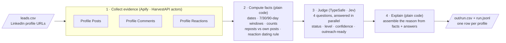
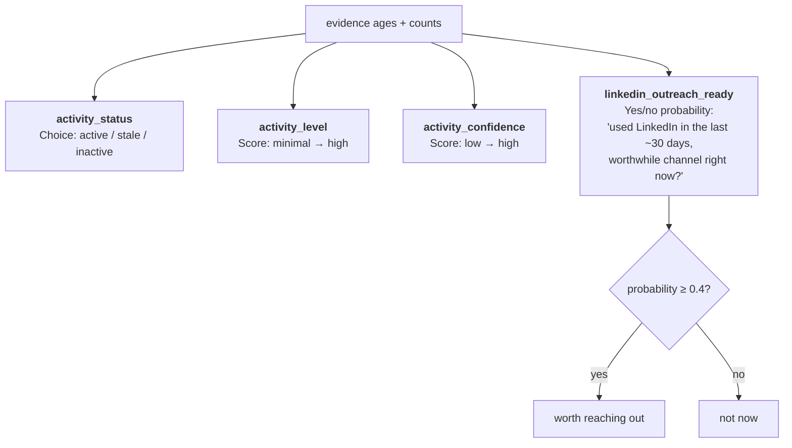

# LinkedIn Profile Activity Intel

**Find out whether a LinkedIn profile is worth reaching out to, and get the reason.**

Give it a list of LinkedIn profile URLs. For each one it tells you:

- **Is this person worth contacting on LinkedIn right now?** — yes/no, a probability, and a plain-English reason
- **When were they last active, and how?** — their own post, a repost, a comment, or a reaction
- **How active are they?** — status (`active` / `stale` / `inactive`), level and confidence
- **The evidence** — dates, counts and links to their most recent post and comment

No LinkedIn login or cookies. You bring two API keys ([Apify](https://apify.com) and [TypeSafe](https://typesafe.ai)) and pay only their usage: about **$0.04 per profile**.

Example output for one profile (a person who likes and comments but rarely posts):

> **Worth reaching out on LinkedIn now (probability 0.83).** Status active: most recent evidence is a reaction on a post from today (so the reaction is at most 1d old). Last 30 days in sample: 0 own posts, 0 reposts, 5 comments, 10 reactions. Engages with others' content rather than posting (no own posts observed). Activity level high; evidence confidence medium (reaction dates are lower bounds).

---

## How it works



Three parts, each doing only what it is good at:

| Step | Who does it | Why |
|---|---|---|
| Collect posts, comments and reactions | Three [HarvestAPI](https://apify.com/harvestapi) actors on Apify | They scrape public LinkedIn activity without an account. |
| Work out dates, time windows and counts | Ordinary Python | Arithmetic should be exact and free. No AI needed. |
| Decide status, level, confidence and "worth reaching out" | [TypeSafe](https://docs.typesafe.ai) (the Jev model) | These are judgment calls about messy evidence. TypeSafe returns typed answers and probabilities, not free text, so the result is structured and cheap (about $0.00002 per profile). |
| Write the reason | Ordinary Python | TypeSafe cannot write sentences. The reason is assembled from the numbers in the same row, so every sentence is traceable and identical runs give identical text. |

There is no large language model, no prompt, and no generated text anywhere in the pipeline.

---

## Quick start

You need [uv](https://docs.astral.sh/uv/) (Python package manager) and two API keys.

**1. Get your keys**

| Key | Where | What it pays for |
|---|---|---|
| `APIFY_TOKEN` | [Apify Console → Settings → Integrations](https://console.apify.com/account/integrations) | The three HarvestAPI actors, billed per item fetched |
| `TYPESAFE_API_KEY` | [TypeSafe](https://typesafe.ai) account | The judgments, billed per input token (negligible) |

**2. Install**

```sh
git clone https://github.com/automatewithuday/LinkedIn-Profile-Activity-Intel.git
cd LinkedIn-Profile-Activity-Intel
uv sync
cp .env.example .env        # then paste your two keys into .env
```

**3. Check the cost, then run**

```sh
uv run activity_intel.py leads.csv --dry-run            # prints profile count and the maximum Apify cost; spends nothing
uv run --env-file .env activity_intel.py leads.csv      # runs it; writes out/<timestamp>.csv and .jsonl
```

That's it. Open the CSV. The first columns are the verdict, the probability and the reason.

---

## Input

Either of these works:

- A **CSV** with a column named `linkedin_url` (other columns are ignored)
- A **text file** with one profile URL per line

URLs must be personal profiles (`linkedin.com/in/...`). Company pages are skipped. Duplicates are removed. Trailing slashes and tracking parameters don't matter.

Useful options:

```
--limit 20                 only the first 20 profiles (good for a trial)
--out results/             write output somewhere else (default: out/)
--config my.toml           use a different settings file (default: config.toml)
--from-raw out/raw/<run>   re-judge a previous run's data without paying Apify again (see below)
```

---

## Output

One row per input profile, in both CSV and JSONL. The important columns first:

### The verdict

| Column | Meaning |
|---|---|
| `linkedin_outreach_ready` | `true` if this person is worth contacting on LinkedIn now. |
| `outreach_ready_probability` | 0 to 1. **Sort by this** to prioritise a list. People who post score ~0.9; people who only like and comment ~0.8; someone whose only trace is one post a month ago ~0.5–0.7; stale profiles ~0.1. |
| `outreach_reason` | The reasoning in one paragraph (see the example at the top). |

### When and how they were last active

| Column | Meaning |
|---|---|
| `days_since_last_activity` | Days since the newest evidence of any kind, with one decimal (`0.4` = about ten hours ago). For a reaction this is an upper bound. |
| `last_activity_type` | `post`, `repost`, `comment` or `reaction`. |
| `most_recent_activity_url` | Link to that newest item (for a reaction: the post they reacted to). |
| `activity_status` | `active` (something within 30 days), `stale` (31–90 days), `inactive` (older than 90 days), `no_activity_observed` (nothing found). |
| `activity_level` | `minimal` / `low` / `moderate` / `high`. |
| `activity_confidence` | `low` / `medium` / `high`: how well the evidence pins down the timing. Reaction-only profiles get at most `medium`, because reactions have no exact date. |
| `active_7d`, `active_30d`, `active_90d` | Simple yes/no flags. |
| `recent_activity_evidence_at` | Timestamp of the newest evidence. |
| `most_recent_exact_activity_at` | Newest post, repost or comment: the latest action with an exact date. Empty for reaction-only profiles. |
| `most_recent_observed_authored_post_at`, `most_recent_post_url` | Their most recent **own** post (reposts excluded). Empty means none was seen in the sample, not that they never posted. |
| `most_recent_observed_authored_comment_at`, `most_recent_comment_url` | Their most recent comment. |

### The counts behind it

| Column | Meaning |
|---|---|
| `post_evidence_count`, `repost_evidence_count`, `comment_evidence_count`, `reaction_evidence_count` | How many of each were fetched (capped by the settings, so these are **sample sizes, not lifetime totals**). |
| `recent_post_evidence_count_30d`, `recent_repost_evidence_count_30d`, `recent_comment_evidence_count_30d` | How many of those fall inside the last 30 days. |
| `recent_reaction_evidence_count_7d`, `_30d`, `_90d` | Same for reactions. |

### Quality flags

| Column | Meaning |
|---|---|
| `success`, `status_code` | `true` / `200` normally. `502` when a data source or TypeSafe failed (`success` stays `true` if at least one source came back); `500` if something unexpected broke for this one profile. Never a crash: every profile gets a row. |
| `data_quality_warning`, `error` | Set when a source failed, TypeSafe failed, or an item had an unusable date. `error` lists every problem. A failed fetch leaves the status **blank** rather than claiming "no activity". |
| `samples_at_cap` | Which sources hit their fetch cap (e.g. `comments,reactions`): the person may have newer activity that was not in the sample. |
| `rejected_evidence_count` | Items dropped because their date was missing, malformed or in the future. |
| `status_matches_date_rule` | `false` means TypeSafe's status disagreed with the plain 30/90-day arithmetic. Rare; worth a look. |

**Before exporting a list to a campaign, hold back rows where `data_quality_warning` is `true` or `status_matches_date_rule` is `false`** and look at them by hand. The run summary on stderr counts them for you.
| `typesafe_status_confidence` | 0 to 1, how sure TypeSafe was about the status. |

---

## How the decision is made

### What TypeSafe sees

TypeSafe never sees post text, names or URLs. It only sees **how old each piece of evidence is** and **how many there are**. For example:

```json
{
  "summary": {
    "post_evidence_count": 1, "repost_evidence_count": 0,
    "comment_evidence_count": 1, "reaction_evidence_count": 3,
    "recent_reaction_evidence_count_7d": 1, "recent_reaction_evidence_count_30d": 2, ...
  },
  "evidence": [
    {"type": "post", "age_days": 3.2},
    {"type": "comment", "age_days": 40.0},
    {"type": "reaction", "age_days_at_most": 4.9},
    {"type": "reaction", "age_days_at_most": 20.1},
    {"type": "reaction", "age_days_at_most": 200.6}
  ]
}
```

Ages are exact to a tenth of a day, and the 30/90-day windows are tested to the millisecond: a post from 30.9 days ago is *not* "within 30 days". The 30/90-day flags are deliberately **left out** of what TypeSafe sees, so it has to judge the evidence rather than copy an answer. If one of the three sources failed for a profile, the summary says so (`"sources_unavailable": ["comments"]`) so the confidence answer can reflect it.

### The four questions

All four are asked in one request and answered in parallel. The exact wording lives in `config.toml` and you can change it.



| Question | Type | Possible answers |
|---|---|---|
| What is this person's current activity status? | Choice | `active`: evidence within 30 days · `stale`: newest is 31–90 days old · `inactive`: nothing within 90 days |
| How frequently are they publicly active? | Score, 4 levels | `minimal`: nothing in 90 days · `low`: one or two actions in 90 days · `moderate`: several actions across 30–90 days · `high`: many actions in 30 days, some within 7 |
| How strongly does the evidence pin down when they were last active? | Score, 3 levels | `low`: very little, or only reactions on old posts · `medium`: some dated evidence but sparse or one kind · `high`: several exactly-dated posts/comments that agree |
| Has this person used LinkedIn within roughly the last 30 days, making it a worthwhile channel right now? | Yes/no probability | 0 to 1; counted as "worth reaching out" at 0.4 or above |

### The reaction dating rule

LinkedIn does not publish when someone reacted to a post. It only tells you the post's date. But a reaction cannot be older than the post it is on, so **the post date is a safe lower bound**:

- A like on a post published 5 days ago proves the person was active within the last 5 days. ✔
- A like on a post published 400 days ago proves nothing recent. It is never counted as recent. ✔

That is why reaction evidence carries `age_days_at_most` instead of `age_days`, and why reaction-only profiles get `medium` confidence at best.

### Reposts

A repost is the person's own action, so it counts as activity, dated by when they reshared. It is **not** counted as an authored post. `most_recent_observed_authored_post_at` only looks at things they wrote themselves.

---

## Cost

Apify charges per item fetched. With the default caps of 5 posts, 5 comments and 10 reactions per profile:

| Item | Price | Per profile (max) |
|---|---|---|
| Posts | $1.50 per 1,000 | $0.0075 |
| Comments | $2.00 per 1,000 | $0.0100 |
| Reactions | $2.00 per 1,000 | $0.0200 |
| TypeSafe | $0.042 per million tokens | ~$0.00002 |
| **Total** | | **≈ $0.04, or $38 per 1,000 profiles** |

Profiles with less activity cost less (you only pay for items that exist). `--dry-run` prints two numbers: the **estimate** (what the caps above add up to) and the **hard cap** (the most Apify is authorised to charge: each actor run gets estimate + 25% + $0.05 headroom, so for one profile that is $0.20 even though the estimate is $0.04). The cap exists so a surprise can't run away; the estimate is what you should expect to pay.

For comparison, LinkedPulse's equivalent check costs $0.03 per profile; this tool costs slightly more but gives you the evidence, the reason, and full control over the rules.

---

## Settings you can change (`config.toml`)

Everything tunable is in one file with comments. The 7/30/90-day windows are fixed in code on purpose: the column names and the question wording depend on them. The main knobs:

| Setting | Default | What it does |
|---|---|---|
| `fetch.max_posts / max_comments / max_reactions` | 5 / 5 / 10 | How many of each to fetch per profile. Higher = more evidence, more cost. |
| `fetch.chunk_size` | 50 | Profiles per Apify run. |
| `judge.outreach_ready_threshold` | 0.4 | Probability at which `linkedin_outreach_ready` becomes `true`. Raise it to be pickier. |
| `judge.workers` | 8 | Parallel TypeSafe calls. |
| `[questions.*]` | see file | The exact wording of the four TypeSafe questions and their answer definitions. |

### Re-judging without paying again

Every run saves the raw fetched data under `out/raw/<timestamp>/`, with a `manifest.json` recording which profiles were queried, every Apify run id and status, the time, and the config used. If you change a threshold or reword a question, re-run on that data for free:

```sh
uv run --env-file .env activity_intel.py leads.csv --from-raw out/raw/20260922-002108
```

Only TypeSafe is called again (a fraction of a cent). Apify is not touched. A profile in your input that the cache never collected comes back as a `502` "not collected" row, not as "no activity".

---

## Things to know before trusting a big list

- **Samples, not totals.** Counts are capped by the settings. "10 reactions" means the fetch cap was hit, not that the person made exactly 10. `samples_at_cap` tells you which sources were saturated.
- **Activity level saturates.** At the default caps, anyone reasonably active fills the whole sample inside 30 days and scores `high`. To rank active people against each other, sort by `outreach_ready_probability` instead.
- **Probabilities wobble slightly.** The same evidence can score 0.78 one run and 0.83 the next. Treat anything between about 0.35 and 0.45 as "maybe" rather than a firm yes or no.
- **Only public activity counts.** Reading the feed, DMs and private-mode activity are invisible. A person can be on LinkedIn daily and still show as inactive if they never post, comment or react.
- **Comments are not returned newest-first.** With a small `max_comments`, the newest comment can be missed. Raise the cap if the exact latest comment matters to you.
- **Validated on active profiles.** The rules were checked live on 11 real active profiles and on synthetic stale/dormant cases (all matched the date rule). No real dormant profile has been through it yet, and the 0.4 threshold has not been checked against reply outcomes: the probability is the model's judgment that LinkedIn is a live channel, not a measured reply rate. If a result looks wrong, the raw data for it is in `out/raw/`.
- **Failures are per profile.** A failed Apify run (`FAILED`, `TIMED-OUT`, aborted by the spend cap) marks only the profiles in that run as unknown; the rest of the batch is unaffected. One malformed item is dropped and counted, never fatal. A "successful" run that quietly skipped some profiles (seen live: HarvestAPI rate limits) is caught from the run log, retried once, and otherwise flagged.

---

## Using it with a coding agent

The repo includes `AGENTS.md` with everything an agent needs: how to run the tool, what the output means, and the rules (always `--dry-run` first, never edit `config.toml` without asking, never print `.env`). `CLAUDE.md` is a one-line file that imports it, so Claude Code picks it up automatically (tested). Codex, Cursor, Gemini CLI and others read `AGENTS.md` by convention but have not been tested here; if yours does not, point it at the file explicitly ("read AGENTS.md and follow it").

So you can say things like *"check which of the people in prospects.csv are worth reaching out to on LinkedIn"* and the agent knows what to do.

---

## Project layout

```
activity_intel.py         the whole tool (~300 lines): load → fetch → compute → judge → explain → write
config.toml               all tunable values and the TypeSafe question wording
test_activity_intel.py    offline tests (uv run pytest -q) — no network, no keys needed
AGENTS.md                 instructions for coding agents (CLAUDE.md imports it)
.github/workflows/        runs the offline tests on every push
.env.example              template for your two keys
example_leads.csv         a two-row sample input
out/                      results and raw data (git-ignored)
```

### Building your own version

If you want to reimplement this in another language or stack, the pieces are:

1. **Fetch** — call the three HarvestAPI actors ([posts](https://apify.com/harvestapi/linkedin-profile-posts), [comments](https://apify.com/harvestapi/linkedin-profile-comments), [reactions](https://apify.com/harvestapi/linkedin-profile-reactions)) with your list of URLs. Every returned item has a `query` field echoing which profile it came from; use that to attribute items. Reposts have `repostedBy` and `repostedAt`. Reaction items have a `createdAt`, but it is just a copy of the post's date, so don't treat it as the reaction time.
2. **Compute** — for each profile, turn every item into `{type, age_days}` (reactions: `age_days_at_most`, from the post date), then derive the newest, the windows and the counts.
3. **Judge** — send the ages and counts to TypeSafe's `POST /v1/systemone` with the four questions from `config.toml` (one Choice, two Scores, one yes/no). Round each Score to its nearest label; compare the yes/no probability to your threshold.
4. **Explain** — build the reason sentence-by-sentence from the row's own numbers.

---

## Troubleshooting

| Message | Cause | Fix |
|---|---|---|
| `No environment file found at: .env` | `.env` doesn't exist in the project folder | `cp .env.example .env` and add your keys |
| `APIFY_TOKEN not set` / `TYPESAFE_API_KEY not set` | Key missing from `.env`, or you forgot `--env-file .env` | Add the key; run with `uv run --env-file .env ...` |
| `ForbiddenError: Too many outstanding invoices` | Your Apify account has unpaid invoices | Settle them in Apify Console → Billing. Nothing was charged. |
| `no LinkedIn /in/ URLs found in input` | Input has no personal profile URLs, or the CSV column isn't named `linkedin_url` | Check the file |
| `[attribute] N items matched no input profile` | With `--from-raw`: the cache holds profiles you did not list this time (normal). On a live run: HarvestAPI changed its output format | Live run: inspect `out/raw/<run>/*.json` and open an issue |
| `[fetch] posts failed for N profiles: run … FAILED` | That Apify run ended without `SUCCEEDED` (actor error, timeout, or the spend cap stopped it) | Those profiles get `502`; re-run just them. Run id and status are in `out/raw/<run>/manifest.json` |
| `[fetch] posts: actor skipped N profiles, retrying once` | HarvestAPI's backend was busy (`Too many queued requests`) and returned nothing for those profiles even though the run "succeeded" | Automatic: they are retried once in their own run. If that fails too they get `502` with `actor errors for N profiles` |
| `[from-raw] no manifest.json` | Cache made by an older version | Still works, but profiles missing from the cache look like "no activity"; re-fetch to get a manifest |
| Row has `status_code: 502` | A data source or TypeSafe failed for that profile (`error` says which) | Re-run; the row's verdict is blank rather than wrong |
| Row has `status_code: 500` | Unexpected error for that one profile (`error` has the exception) | Open an issue with the row and its raw items |

---

## License

MIT — see [LICENSE](LICENSE). Use it, change it, sell with it; just keep the notice.

## Credits

Built on [HarvestAPI](https://apify.com/harvestapi) actors (Apify) and [TypeSafe](https://typesafe.ai). Inspired by the output format of [LinkedPulse](https://apify.com/saasydb/linkedpulse-linkedin-activity-intelligence). Not affiliated with LinkedIn.
